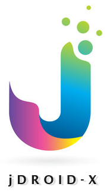

<div align="center">
  
  <h1>FreeModelsClub</h1>
  <p><strong>Enterprise-Grade Localhost Smart Chatbot & Universal AI Proxy Gateway</strong></p>
</div>

---

**FreeModelsClub** is a highly advanced, zero-trust localized smart chatbot and OpenAI-compatible API proxy. It acts as an intelligent gateway to seamlessly aggregate, monitor, load-balance, and route your inference calls across a multitude of free and open-weights LLMs from providers like **Groq**, **Google Gemini**, **OpenRouter**, and local **Ollama** models.

## ✨ Core Features

### 🔌 Universal OpenAI-Compatible API Proxy
Easily plug FreeModelsClub into any IDE (like VSCode, Cursor), Desktop Agent (like Claude Desktop), or CLI tool by simply substituting their API Base URL with `http://localhost:12247/v1`. FreeModelsClub translates outgoing requests to fit the requirements of Groq, Gemini, or Anthropic instantly on the fly.

### ⚖️ Model Club & Smart Load Balancing
Create **Model Combos** to logically group different AI models together.
- **Round-Robin Strategy**: Evenly distribute requests across multiple free models to completely avoid rate limits.
- **Fallback Strategy**: Automatically fail-over to a backup model if the primary model goes offline or throws a 429 Rate Limit error.

### 🎨 22 Curated Multi-Palette Themes & 4-Color Substrate Engine
Experience a visually rich, eye-candy glassmorphism interface across 4 distinct categories:
- **7 Metal Themes**: Platinum Silver, Gold Royal, Silver Classic, Titanium Modern, Bronze Antique, Copper Industrial, Obsidian Stealth.
- **5 Natural Themes**: Emerald Forest, Deep Ocean, Nordic Pine, Sahara Desert, Autumn Maple.
- **5 Cosmic Themes**: Nebula Violet, Galaxy Starlight, Solar Flare, Aurora Borealis, Deep Cosmos.
- **5 Popular Internet Themes**: Dracula Dark, Tokyo Night, Catppuccin Mocha, Nord Ice, Cyberpunk Neon.
- **4-Color Substrate Palettes**: Every theme provides calibrated `--bg-dark`, `--bg-sidebar`, `--bg-card`, and `--primary` tokens with 25% darker button depth and specular hover highlights.

### 🔤 12 Crystal-Clear Online Typography Choices & Interactive Resizing
- **12 Top Fonts**: System Default Native, Inter, Outfit, Plus Jakarta Sans, Roboto, Space Grotesk, JetBrains Mono, Fira Code, Manrope, DM Sans, and Sora.
- **Interactive UI/UX Customizer**: Adjust Base Font Size (11px–18px), Font Weight (300–700), Letter Spacing (-1px to +2px), Line Height (1.2–1.8), Card Padding (2px–24px), Backdrop Blur, and Glass Opacity.
- **Fresh Install Intelligence**: Defaults to System Default Native Font on clean install, and automatically persists & hydrates saved typography across browser sessions.

### 🌟 Unified Icon System & RAG Telemetry Immunity
- **Transparent Backgrounds**: 100% transparent icon backgrounds across all buttons, navigation items, cards, and drawers.
- **Dynamic Viewport Scaling**: Adaptive icon scaling via `font-size: clamp(0.72rem, 1em, 1.25rem)`.
- **Theme Specular Glow**: Non-status icons smoothly transition to the theme's active glow on hover.
- **🛡️ RAG Status Protection**: Functional health badges (`.badge-emerald`, `.badge-amber`, `.badge-rose`, `.badge-cyan`) are immune to theme overrides to guarantee telemetry accuracy.

### 📊 Real-Time Telemetry Dashboard
A beautiful, responsive glassmorphism UI tracks your exact API usage:
- Live streaming token tracking (Prompt vs Completion tokens)
- Request latency measuring (milliseconds)
- Provider status monitoring (Active vs Offline)
- Total diagnostic traces and error root cause analysis (400, 429, 500 error breakdowns)

### 🛡️ Zero-Trust Security & Self-Healing
- **AES-256-GCM CryptoVault**: Provider API keys are encrypted at rest with hardware/device-bound cryptographic salts.
- **Outbound Key Resolution**: Masked placeholders (`"********"`) in the UI are dynamically resolved to decrypted keys before outbound API calls, preventing plaintext exposure.
- **Crash-Safe Persistence**: Employs dynamic `.tmp` atomic file writing mechanisms to ensure your configurations are never corrupted during a crash.
- **Auto-Database Seeding**: The app automatically generates the required database structure, schemas, and default credentials upon its first boot.
- **Aggressive Rate Limiting**: Built-in mechanisms to prevent request flooding and preserve system memory.
- **Strict 127.0.0.1 Localhost Binding**: Zero-trust CORS and CSP security headers prevent unauthorized external origin access.

### 🏗️ Strict OOPS MVC Enterprise Architecture
Built on a robust, highly cohesive 3D Program Matrix:
- **Dimension 1**: View Controllers & DOM Render Layer (`DashboardView`, `PlaygroundView`, `RegistrationView`, `ProvidersView`, `ModelClubView`, `SettingsView`, `ReportsView`, `ManualView`)
- **Dimension 2**: Execution Engine & Multi-Thread Processing Services (`ProxyEngineService`, `ModelSelectionService`, `ModelLoadBalancer`, `ProgramMappingAgent`)
- **Dimension 3**: Auto-managed JSON Persistence Layer (`data/users.json`, `data/providers.json`, `data/models.json`, `data/combos.json`, `data/taxonomy.json`, `data/program_mapping.json`)

---

## 🚀 Prerequisites

Ensure your system has the following installed before proceeding:
- **Node.js**: `v18.0.0` or higher
- **Git**: To clone the repository

---

## 📦 Fresh System Installation Guide

Follow these step-by-step instructions to get FreeModelsClub running on a fresh machine seamlessly:

### 1. Clone the Repository
Open your terminal/command prompt and clone the codebase:
```bash
git clone https://github.com/jDroid-X/FreeModelClub.git
cd FreeModelClub
```

### 2. Window's Direct Install (Recommended for Windows Users)
If you are on Windows, you can simply use the provided automated batch scripts to install and launch the application without opening a command prompt.

1. **Install:** Double-click on `Install_FreeModelsClub.bat` to automatically download and configure all necessary dependencies. Wait for the success message. The application will be installed to `%USERPROFILE%\jDroid-X\FreeModelClub\`.
2. **Launch:** Double-click on `Launch_Server_Console.bat` (or your preferred launch script) to start the server and automatically open the FreeModelsClub Smart Dashboard in your browser.

> [!NOTE]
> **Fresh Seed Database:** The `data/` directory is pre-seeded with clean, zeroed-out templates for 17 AI providers and 44 free models.
> FreeModelsClub features an **Auto-Seeding Engine** that dynamically initializes default schemas securely upon first boot!
> 
> **Default Install Location:** By default, the application installs to `%USERPROFILE%\jDroid-X\FreeModelClub\`. This is outside your OneDrive sync folders and keeps the app fully contained within the jDroid-X ecosystem.

### 3. Manual Installation (NPM Dependencies)
If you are on Linux/macOS or prefer the command line, use the built-in deterministic installer script which provisions your local environment safely:
```bash
npm install
```

### 4. Application Lifecycle Management (Batch Scripts)
We provide a strict suite of enterprise-grade scripts to manage the application cleanly:

- `Install_FreeModelsClub.bat`: Verifies environment, builds directories, and installs dependencies.
- `Launch_Server_Console.bat`: Performs health checks, ensures ports are free, boots the server, and opens the UI.
- `Update_FreeModelsClub.bat`: Safely creates timestamped backups of your API keys/data before pulling new code from GitHub.
- `Stop_FreeModelsClub.bat`: Cleans up the background Node process and unbinds port 12247 safely.
- `Uninstall_FreeModelsClub.bat`: Wipes dependencies while offering options to preserve or destroy your configurations.

### 5. Launch the Server
You can boot the application using any of the following methods:

- **Method A: Standard NPM Launch (Cross-Platform)**
  ```bash
  npm start
  ```

- **Method B: Windows Console Launcher**
  Double click on `Launch_Server_Console.bat`. This will open a dedicated terminal window showing you real-time server logs and API pings.

- **Method C: Silent Background Launcher (Windows)**
  Double click on `Launch_Silent.vbs`. The server will boot completely invisibly in the background without cluttering your taskbar.

### 6. Access the Smart Dashboard
Once the terminal reads `FreeModelsClub Localhost Smart Chatbot Server Running!`, open your browser and navigate to:
👉 **http://localhost:12247**

**Default Login Credentials:**
- **Email**: `FreeModelsClub@jdroidxy.com`
- **Password**: `Admin@1234`

*(You will be prompted to register your first Provider immediately upon logging in.)*

---

## 🔗 Integrating 3rd-Party AI Tools

FreeModelsClub acts as a central nervous system for all your AI development tools. By linking them to this localhost server, you gain centralized telemetry and rate-limit protection.

Configure any external tool (Cursor, Windsurf, Claude Desktop, Antigravity) with the following standard credentials:
- **Base URL**: `http://localhost:12247/v1`
- **API Key**: `fmc-live-key-jdroidxy-2026` *(This is your default localhost key, viewable in the Settings tab).*

### Example: Connecting Anthropic Claude Desktop
FreeModelsClub automatically translates Claude's `/v1/messages` format into standard OpenAI protocols!
1. Open your `claude_desktop_config.json`
2. Point the Anthropic Base URL to `http://localhost:12247/v1`
3. Check the **Settings -> Tool Connections** tab in the FreeModelsClub dashboard for an exact copy-paste configuration snippet!

---

## 📚 Development & Documentation Guidelines

For contributors and agents interacting with this codebase, FreeModelsClub rigidly enforces a **7-Stage Closed-Loop Waterfall (OOPS MVC)** framework.
Every major architectural enhancement must flow through:
1. INITIATE & PLAN
2. REQUIREMENTS ANALYSIS
3. SYSTEM DESIGN
4. IMPLEMENTATION
5. TESTING
6. DEPLOYMENT
7. MAINTENANCE & SUPPORT (Closed-Loop Feedback)

Check the `.agents/workflows/` directory for exhaustive development rules and pony-tail code-limit mandates.
The canonical project agent map is defined in `.agents/agent-architecture.md` and extends the existing `SearchAgent`, `ProviderAgent`, `MonitoringAgent`, and `ProgramMappingAgent` roles without replacing them.

---

<div align="center">
  <p>Built for resilience, scale, and zero-cost LLM orchestration.</p>
  <p>Licensed under <b>MIT</b>.</p>
</div>
